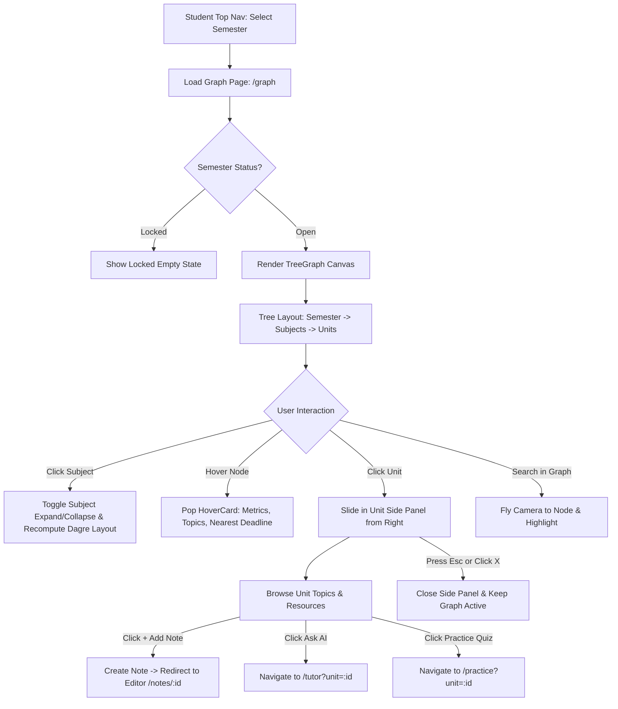
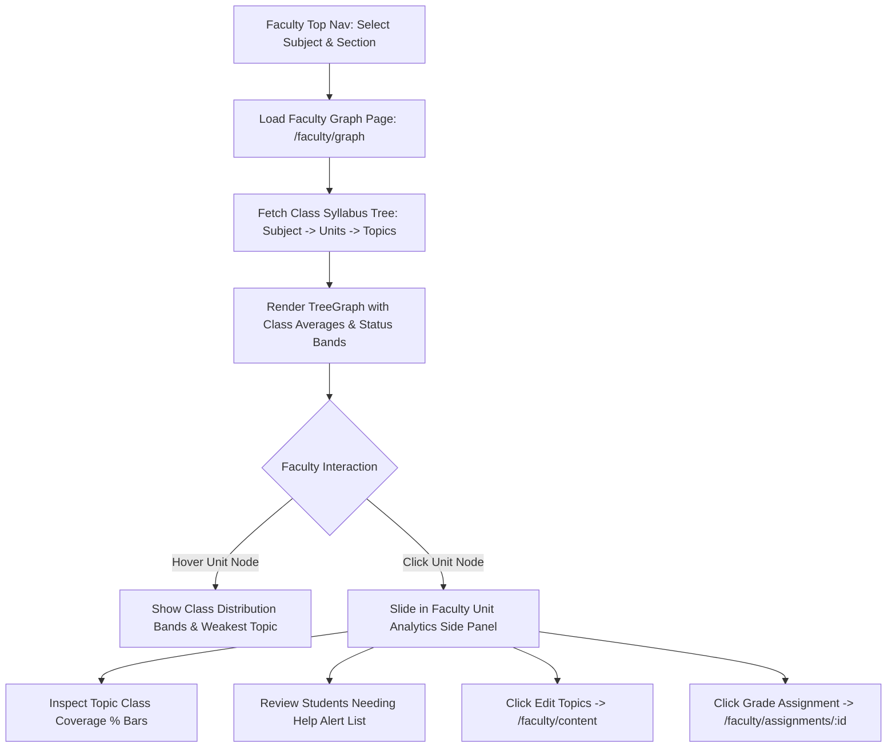

# NODUS User Flows

## Student Graph View Flow

```mermaid
flowchart TD
    A[Student Top Nav: Select Semester] --> B[Load Graph Page: /graph]
    B --> C{Semester Status?}
    C -->|Locked| D[Show Locked Empty State]
    C -->|Open| E[Render TreeGraph Canvas]
    E --> F[Tree Layout: Semester -> Subjects -> Units]
    F --> G{User Interaction}
    G -->|Click Subject| H[Toggle Subject Expand/Collapse & Recompute Dagre Layout]
    G -->|Hover Node| I[Pop HoverCard: Metrics, Topics, Nearest Deadline]
    G -->|Click Unit| J[Slide in Unit Side Panel from Right]
    G -->|Search in Graph| K[Fly Camera to Node & Highlight]
    J --> L[Browse Unit Topics & Resources]
    L -->|Click + Add Note| M[Create Note -> Redirect to Editor /notes/:id]
    L -->|Click Ask AI| N[Navigate to /tutor?unit=:id]
    L -->|Click Practice Quiz| O[Navigate to /practice?unit=:id]
    J -->|Press Esc or Click X| P[Close Side Panel & Keep Graph Active]
```

## Faculty Graph View Flow

```mermaid
flowchart TD
    FA[Faculty Top Nav: Select Subject & Section] --> FB[Load Faculty Graph Page: /faculty/graph]
    FB --> FC[Fetch Class Syllabus Tree: Subject -> Units -> Topics]
    FC --> FD[Render TreeGraph with Class Averages & Status Bands]
    FD --> FE{Faculty Interaction}
    FE -->|Hover Unit Node| FF[Show Class Distribution Bands & Weakest Topic]
    FE -->|Click Unit Node| FG[Slide in Faculty Unit Analytics Side Panel]
    FG --> FH[Inspect Topic Class Coverage % Bars]
    FG --> FI[Review Students Needing Help Alert List]
    FG --> FJ[Click Edit Topics -> /faculty/content]
    FG --> FK[Click Grade Assignment -> /faculty/assignments/:id]
```
